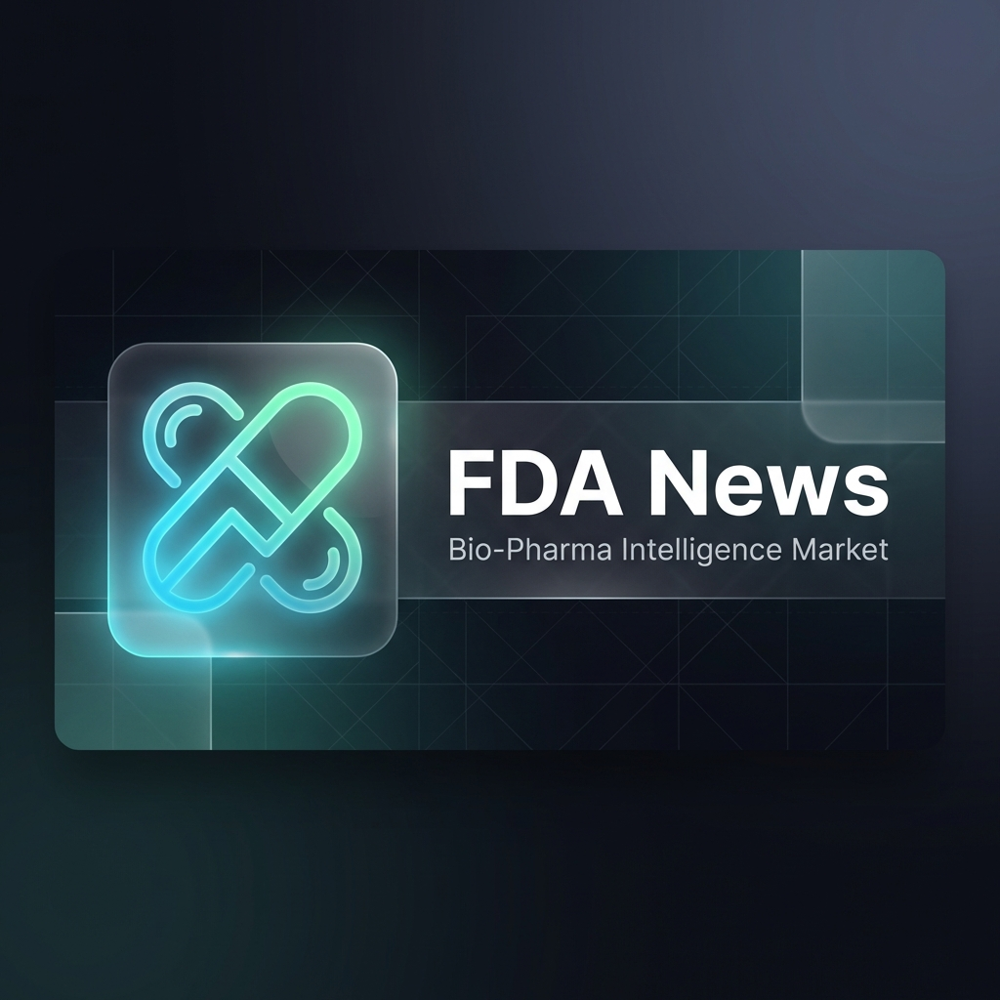

# 💊 FDA Last News

### *Real-Time Regulatory Intelligence for the Modern Bio-Pharma Investor.*

<div align="center">
  
</div>



**FDA Last News** is a premium, **fully responsive** data aggregation platform designed to solve the "Information Overload" problem in the biotechnology and pharmaceutical sectors. We transform raw regulatory data from the FDA into actionable market intelligence, optimized for both **Human Search (SEO)** and **AI Context (AI SEO)**.

---

## 🚀 Why This Matters for Investors

Investing in Bio-Pharma is high-risk and high-reward. **Timing is everything.** A single FDA approval or recall can shift billions in market cap in minutes. 

Our tool simplifies the investor's life by:

*   **Cutting Through the Noise**: We filter out irrelevant filler and focus on **PDUFA dates**, **FDA approvals**, and **negative enforcement actions (recalls)**.
*   **Connecting the Dots**: We don't just show you a drug name; we show you the **Market Reaction** instantly through integrated real-time stock charts.
*   **Regulatory Alpha**: By combining official OpenFDA data with financial news from Finnhub, you get the "Why" behind the "What" before the mainstream media catches up.
*   **No More Manual Hunting**: Stop refreshing 20 different government RSS feeds. We centralize the official FDA enforcement reports and press releases in one glassmorphic dashboard.

---

## ✨ Key Features

-   **🎯 Decision Dashboard**: High-level view of the latest FDA approvals and their immediate market impact.
-   **📅 2026 PDUFA Calendar**: Stay ahead of the curve with a curated list of upcoming drug decision dates.
-   **📰 Unified News Feed**: Official FDA enforcement reports merged with real-time pharmaceutical financial news.
-   **📈 Integrated Market Data**: Powered by Finnhub, featuring real-time stock tickers and interactive performance charts for sponsoring companies.
-   **🤖 AI-Optimized**: Fully optimized for LLMs (ChatGPT, Claude, Perplexity) via `llms.txt` and rich JSON-LD structured data.

---

## 🛠️ Tech Stack

-   **Framework**: [Astro 5.0](https://astro.build/) (SSR Mode for real-time freshness)
-   **Styling**: Vanilla CSS with **Glassmorphism** design principles.
-   **Data Sources**: 
    -   **OpenFDA**: Official drug approvals and enforcement records.
    -   **Finnhub.io**: Global equity data and pharma news.
-   **Icons**: Lucide Astro.
-   **Charts**: Lightweight Charts (TradingView).

---

## ⚙️ Configuration

To run this platform locally or in production, you'll need the following environment variables in your `.env` file:

```env
FINNHUB_API_KEY=your_finnhub_key_here
OPENFDA_API_KEY=your_openfda_key_here (optional, but recommended for high traffic)
```

### Getting Started

1.  **Install dependencies**: `npm install`
2.  **Run dev server**: `npm run dev`
3.  **Build for production**: `npm run build`

---

## 🔒 Security & Performance

-   **Zero Client-Side Leaks**: All API keys are handled server-side via Astro's SSR.
-   **Optimized Indexing**: Includes 1200x630 OG Banner, `sitemap.xml`, and `robots.txt` for professional search visibility.

---
*Created for Jose Alvarez Dev with intensity for the next generation of biotech intelligence.*
