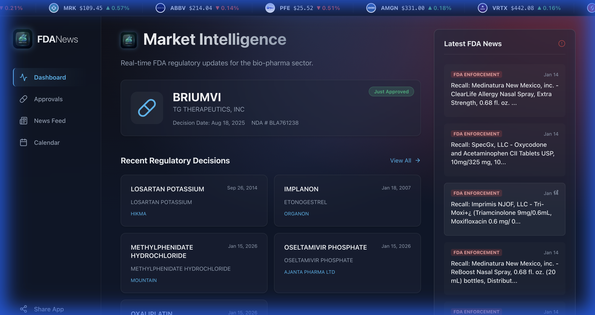
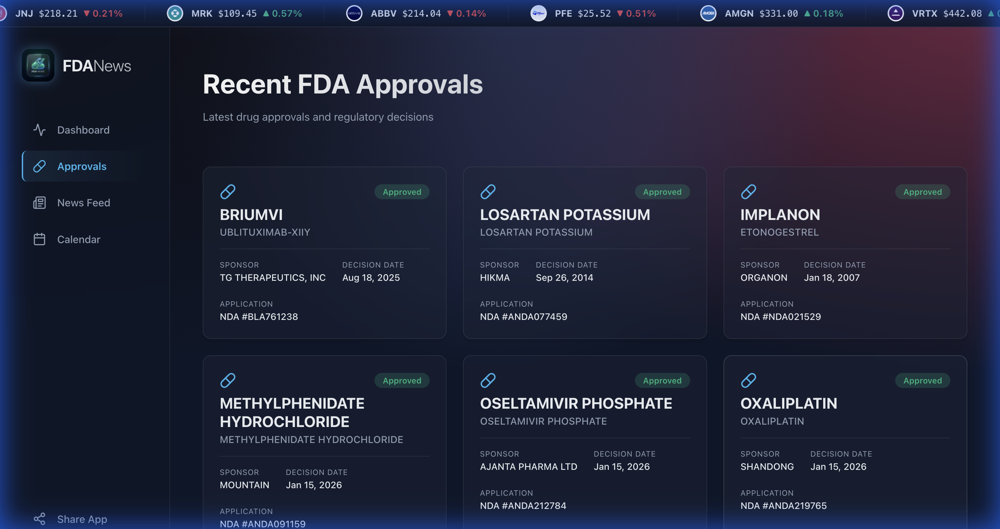
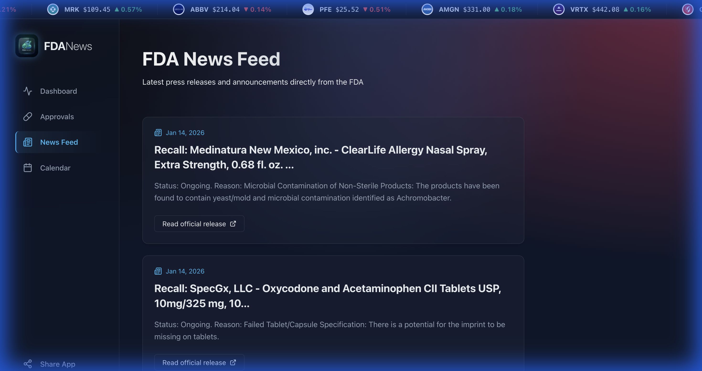
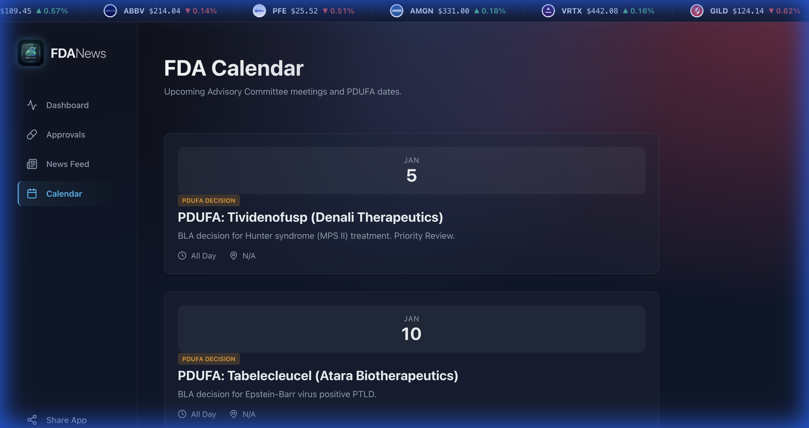

# 💊 FDA Last News

### *Real-Time Regulatory Intelligence for the Modern Bio-Pharma Investor.*

  

**FDA Last News** is a premium, **fully responsive** data aggregation platform designed to solve the "Information Overload" problem in the biotechnology and pharmaceutical sectors. We transform raw regulatory data from the FDA into actionable market intelligence, optimized for both **Human Search (SEO)** and **AI Context (AI SEO)**.

---

## 🚀 Why This Matters for Investors

Investing in Bio-Pharma is high-risk and high-reward. **Timing is everything.** A single FDA approval or recall can shift billions in market cap in minutes. 

Our tool simplifies the investor's life by:

*   **Cutting Through the Noise**: We filter out irrelevant filler and focus on **PDUFA dates**, **FDA approvals**, and **negative enforcement actions (recalls)**.
*   **Connecting the Dots**: We don't just show you a drug name; we show you the **Market Reaction** instantly through integrated real-time stock charts.
*   **Regulatory Alpha**: By combining official OpenFDA data with financial news from Finnhub, you get the "Why" behind the "What" before the mainstream media catches up.
*   **No More Manual Hunting**: Stop refreshing 20 different government RSS feeds. We centralize the official FDA enforcement reports and press releases in one glassmorphic dashboard.

---

## ✨ Key Features

-   **🎯 Decision Dashboard**: High-level view of the latest FDA approvals and their immediate market impact.
-   **📅 2026 PDUFA Calendar**: Stay ahead of the curve with a curated list of upcoming drug decision dates.
-   **📰 Unified News Feed**: Official FDA enforcement reports merged with real-time pharmaceutical financial news.
-   **📈 Integrated Market Data**: Powered by Finnhub, featuring real-time stock tickers and interactive performance charts for sponsoring companies.
-   **🤖 AI-Optimized**: Fully optimized for LLMs (ChatGPT, Claude, Perplexity) via `llms.txt` and rich JSON-LD structured data.
-   **🚀 Live Deployment**: [https://fdanews.web.app](https://fdanews.web.app)

---

## 📸 Visual Showcase

### 🖥️ Decision Intelligence Dashboard
The central hub for real-time FDA approvals and market sentiment.

### 💊 Recent Approvals & Regulatory Trace
Track every drug submission and approval status with deep clinical context.

### 📰 Unified Industry News Feed
A fusion of official FDA enforcement reports and premium financial pharma news.

### 📅 PDUFA & Milestone Calendar
Stay ahead of market-moving events with our curated PDUFA calendar.

---

## 🛠️ Tech Stack

-   **Framework**: [Astro 5.0](https://astro.build/) (SSR Mode for real-time freshness)
-   **Styling**: Vanilla CSS with **Glassmorphism** design principles.
-   **Data Sources**: 
    -   **OpenFDA**: Official drug approvals and enforcement records.
    -   **Finnhub.io**: Global equity data and pharma news.
-   **Icons**: Lucide Astro.
-   **Charts**: Lightweight Charts (TradingView).

---

## 🔒 Proprietary Protection & Security

This platform is a **private, proprietary tool**. We have implemented several layers of security to ensure the integrity of the data and the user experience:

-   **Zero Client-Side Leaks**: All API keys are handled server-side via Astro's SSR.
-   **Anti-Tamper Intelligence**: The frontend includes protection against unauthorized inspection (DevTools blocking) and content manipulation to preserve the premium immersion.
-   **Optimized Indexing**: Professional search visibility via `sitemap.xml`, `robots.txt`, and rich structured data.

---

## ⚙️ Project Status

This repository is for **internal demonstration and private deployment only**. Unauthorized cloning, modification, or redistribution of the source code is strictly prohibited.

---
*Created for Jose Alvarez Dev with intensity for the next generation of biotech intelligence.*
